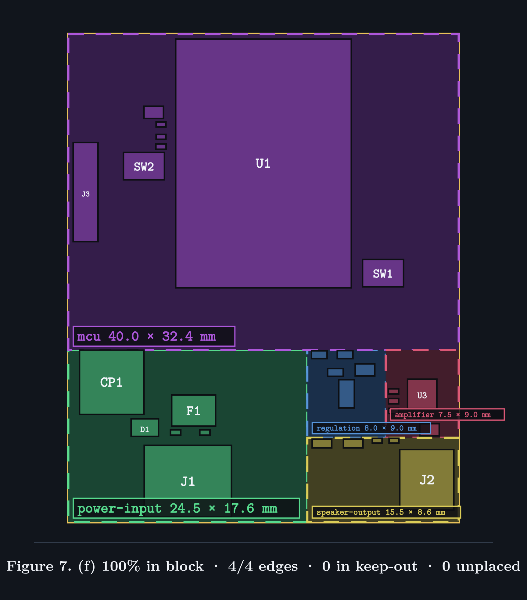

# esp32-amp, 40 × 50 mm, floorplan (f)

The best-looking layout produced so far: every part inside its subsystem, every
connector on the edge it was given, nothing in the antenna keep-out, nothing
unplaced. Kept here because `manual-tests/runs/` is wiped on every run.



```
100% in block  ·  4/4 edges  ·  0 in keep-out  ·  0 unplaced  ·  0 overlaps
```

| block | region | holds |
| --- | --- | --- |
| mcu | 40.0 × 32.4 mm at (100.0, 100.0) | U1 across the north edge, antenna overhanging |
| power-input | 24.5 × 17.6 mm at (100.0, 132.4) | J1 on the south edge |
| regulation | 8.0 × 9.0 mm at (124.5, 132.4) | |
| amplifier | 7.5 × 9.0 mm at (132.5, 132.4) | |
| speaker-output | 15.5 × 8.6 mm at (124.5, 141.4) | J2 on the east edge |

## What is right

All four edge constraints land: J1 south, J2 east, J3 west, U1 north with its
antenna over air. The blocks read as coherent areas rather than as scatter, and
the packing inside each is tight and non-overlapping.

## What is wrong, and why it is kept anyway

**CP1 sits 20 mm from U3.** It is the class-D bulk capacitor for U3, but this
floorplan predates brick 3c, so CP1 was still filed under *Power Input* — the
schematic sheet it happened to be drawn on. That one misplacement drove the
switching loop to 94 mm² against its 40 mm² budget, the most important physical
relationship on the board.

So this layout is **complete but electrically wrong**. After brick 3c the same
candidate is electrically right and *incomplete*: CP1 correctly moves to
`amplifier`, which is then too small to hold it. Neither is finished; kept as
the reference for what "looks like a board" means until one is.

Three smaller gaps, all visible in the render:

- `mcu` is mostly empty — U1 centred in 40 × 32.4 mm with wide margins, because
  the floorplanner allocates area proportionally and the block is 2.4× its
  demand.
- J3 sits at the top of the west edge, far from U1's UART pins (37, 36). Brick 3
  centres an edge part along its region's span and has no idea which end is
  nearer the pins it serves.
- U1's decoupling caps cluster outside the module rather than at the pins they
  decouple: placed near the pad but never rotated, so they sit wherever the ring
  search first found room.

## Provenance and what is missing

Rendered from the brick 3a placer. The placement was rendered straight from the
IR and **no `.kicad_pcb` was written**, so this cannot be opened in KiCad and
cannot be reproduced exactly — the placer has moved on since (bricks 3b, 3c).

`intent.yaml` was recovered from `layout.svg`, whose region rectangles carry the
exact geometry. It will reproduce *this floorplan*, not this placement.

> Worth fixing in the harness: a layout worth keeping should be written as a
> board, not only as a picture.
